.. iNaturalist Discord Server Guide for Participants

=================================================
iNaturalist Discord Server Guide for Participants
=================================================

About this guide
----------------
This guide has a number of sections aimed at introducing our new
and existing users to Discord itself, the iNaturalist Discord Server,
and its bots and channels.

If you already know the :ref:`Discord Basics` and how to use Discord, you may
wish to skip ahead to :ref:`Set Up Your Roles` and then the sections introducing you
to :ref:`Participating` in the various channels on the server.

Once you're comfortable with all that, :ref:`Using the Discord Bots` addresses using 
Dronefly and Dumbo, and is the largest and most technical section of the Guide.

Finally, :ref:`Appendices` covers miscellaneous topics.

==============
Discord Basics
==============

Discord is a proprietary freeware VoIP application and digital
distribution platform that specializes in text, image, video and audio
communication between users in a chat channel. Discord runs on Windows,
macOS, Android, iOS, Linux, and in web browsers.

Get Discord
-----------

Browser URL: https://discord.com

Software: https://discord.com/download

You can also find the Discord app in the Apple App Store or on Google
Play.

Once you have Discord, you’ll need an invitation to the iNaturalist
Discord server. A permanent standing invitation exists here:

https://discord.gg/eCD4WvT (opens in #introductions)

Discord Layout and Functions
----------------------------

Discord will look different depending on platform, but in general, you
can expect something like this:

|image1|

Let’s take a look at each of those features in more detail:

|image2|

You can change your status by clicking on your avatar in the lower left,
and using the pop-up menu.

|image3|

|image4|

The home button will take you to your Home Screen, from which you can
Direct Message other users, see your Friends and start video or voice
calls with them.

Each of the servers (a.k.a. guilds) you belong to are shown. In this
case, we’ll focus on the iNaturalist Discord server, but there’s also
Dronefly (related to bot development) where you can find some of the
same participants.

The plus sign allows you to add other servers.

The magnifying glass allows you to look for other servers.

|image5|

Selecting the down arrow next to the Server name in the upper left
allows you to take a variety of actions, including:

|image6|

Invite People - Inviting friends and other naturalist professionals to join us (if you
use this, create from #introductions)

Notification Settings - Adjusting your notification settings (see :ref:`Appendix A - Notification Settings`)

Privacy Settings - Allowing or prohibiting direct messages from other users

Change Nickname - Changing your nickname (for instance, to add your location to your
nickname, e.g. michaelpirrello \|\| Pennsylvania)

Leave Server - Leaving (Hopefully you’ll never want to, but sometimes life gets in the
way.)

Beneath the iNaturalist header bar is the channel list. Channels are
organized by the categories shown. You may have categories or channels
of particular interest, and others you have no interest in. You can
collapse categories as shown, or expand them to see all the channels. If
you collapse the categories, only those channels with new content will
be shown.

|image7|

If you want to mute a channel, the easiest way is to use the bell icon
in the upper right corner once you’re in a channel (|image8|).

|image9|

When you first join the server, visit the #introductions channel (under
the Important heading), where the Dronefly bot (and hopefully some
active users) will welcome you.

If you want to participate in the server’s iNaturalist projects, or use
the Dronefly bot, post your profile (https://www.inaturalist.org/people/
followed by your username or user number, e.g.
https://www.inaturalist.org/people/1276353).

You can find your profile using the menu in the upper right corner when
you’re using iNaturalist in a browser.

Pinned messages are posts that have occurred in a channel that
moderators have decided are either particularly important, or equally as
likely, particularly funny. You’ll find both useful information and
humorous items in pinned messages.

|image10|

For instance, in the #bot-stuff channel, you’ll find information about
commands you can use with bots as pinned items.

Other pinned items may be...less useful.

|image11|

The member list button (|image12|) at the upper right toggles the member
list visibility on and off (good if you need more screen space, or if
you need to contact an Admin or a Moderator and want to know who is
available.) Right clicking on users in the member list allows you to see
their profile (which can be helpful when temporary nickname changes
occur).

=================
Set Up Your Roles
=================

The #role-menus channel (under the Important heading) is one of the
first channels every new user should visit. Configuring details about
your appearance on the server and the roles you want is as easy as
pressing some buttons. Roles primarily allow you to be notified when
someone is seeking information on a topic you’re interested in, or
something is happening you may want to participate in (e.g. a voice
chat).

|image13|

Other roles can only be assigned by moderators, some by request, and
some based on achievement. For instance, talking with people on the
server will earn you the Naturalist role.

=============
Participating
=============

Participating - #chat (under General)
-------------------------------------

Follow the rules in the #welcome channel for communicating with others.

#chat and #chat-2-eclectic-beluga are both general nature-oriented chat
channels. If one is busy with an ongoing discussion, and you want to
start a new topic, use the other.

Basic chat functions
^^^^^^^^^^^^^^^^^^^^

Typing\ ``@username`` will “ping” the user.

Typing ``#channel`` will create a link to that channel.

Typing a URL will create a preview embed beneath the URL.

|image66|

The emoji menu (|image45|) next to each message provides numerous ways
to react.

|image46|\ on the left of the message bar allows for uploading files and
images to the chat.

Let a moderator know if you think a file is important enough to be
pinned.

Participating - #suggestions (under Important)
----------------------------------------------

Anyone can make a suggestion to improve the server in this channel.

Participating - #inat-questions and #inat-curation (under iNat Stuff)
---------------------------------------------------------------------

Ask and answer user and curator questions about iNaturalist and how it
works in these channels. Don’t forget to check pinned messages and use
the search function to see if your question has been asked/answered
before. If you can’t get an answer here, the iNaturalist Forum is
another good place to post questions: https://forum.inaturalist.org/

Participating - #id-confirmation and #work-party (under Identify)
-----------------------------------------------------------------

Use the #id-confirmation channel for:

-  Posting an observation where you’ve made an ID and are looking for a
   confirmation.
-  Posting an observation where you’re looking for a more specific
   identification (or, post in a taxa-specific channel - both are
   appropriate)

Use the #work-party channel for:

Posting tasks for the general good of iNaturalist that server
participants can help with.

Examples include:

-  Posting Unknowns that need coarse ID’s
-  Correcting misidentifications (where a misidentification is firmly
   embedded with many confirmations, you can also ping the @work-party
   role)
-  https://forum.inaturalist.org/t/state-of-matter-life-clean-up/3556
-  https://forum.inaturalist.org/t/computer-vision-clean-up-wiki/7281
-  https://forum.inaturalist.org/t/ways-to-help-out-on-inat-wiki/1983

Participating - |image47|\ General and #vc-general (under Voice Channels)
-------------------------------------------------------------------------

Voice channels (like |image48|) allow you to talk and listen to other
iNaturalist Discord Server participants in real time.
Presentations/Entertainment may take place here as well. #vc-general is
used for text chat in support of the General voice channel (e.g. sharing
pictures as you talk.)

The Go Live! Feature (|image49|) allows for screen sharing (only in the
Discord software, not available in the browser version). Once a
presenter goes live, you will need to select “Join Stream” to see the
screen they’re sharing.

|image50|

Please don’t forget to mute yourself (|image51|) if someone else is
presenting.

Click the Disconnect icon (|image68|) to leave a voice chat

======================
Using the Discord Bots
======================

Access to the Discord bots is one of the great benefits of being on the
server. Bots are primarily for obtaining information.

There are several bots, which are instances of `Red Discord
Bot <https://github.com/Cog-Creators/Red-DiscordBot>`__, each with a
different function. You can access the functions of the bots using the
prefix specific to the bot:

`Dronefly <https://github.com/synrg/dronefly/>`__ (``,``) - Accesses
iNaturalist and other naturalist-related web platforms.

Dumbo (``-``) - For general purpose admin & info functions, not strictly
nature-related (e.g. Twitter and Wikipedia).

Pickerel (``$``) - Plays audio (e.g. music) from SoundCloud, Spotify, and
YouTube in the Music channel.

(CuckooBee (``/`` or ``c.``) is the development version of Dronefly, so if
you’re not interested in bot development, you won’t need it. If you
indicate that you’re interested in helping with bot testing, you may
occasionally receive an invite to participate in testing features.)

|image14|

Notes on reading the online bot help:

-  If there is no punctuation, type it exactly as shown (literal)
-  If there are ``<angle brackets>``, it is representative of what should be
   typed
-  If there are ``[square brackets]``, it is an optional input

Dronefly Introduction
---------------------

Access help using ``,help``. See the help topics for each command and
subcommand for details.

A guide to using the Dronefly bot is available on the iNaturalist Forum
here:

https://forum.inaturalist.org/t/how-to-use-dronefly-a-discord-chat-bot/9770

Dronefly Commands
-----------------

``,image`` (``,img``)

- Show default iNaturalist image for taxon query.

|image16| \ |image15| 

Note that you can press the buttons below the image to generate
reactions with information (shown above the image on the right) as
follows:

|image17| \ Will indicate the number of observations you’ve made

|image18| \ Will indicate the number of observations made by a user you
specify

|image19| \ Will indicate the number of observations from your home place
(see ``,user`` below)

|image20| \ Will indicate the number of observations made from a place
you specify

|image21|

``,last``

- Show info for recently mentioned iNaturalist page. Operators
  are ``obs`` or ``taxon``. Can be further expanded using ``<rank>``, ``img``,
  ``map`` or ``taxon``.

``,link``

- Show summary for iNaturalist link.
- If autoobs is turned on, put angle brackets around the URL, e.g. ``,link <https://inaturalist.ala.org.au/observations/56605848>`` to avoid getting the image displayed twice.

|image22|

``,map``

- Show iNaturalist range map for a list of one or more taxa
  (comma delimited)

``,my`` 

- Show your observations, species, & ranks for an iNat project., e.g. ``,my 2020``

My subcommands
^^^^^^^^^^^^^^^^^^

|image70|

``inatyear`` - Display the URL for your iNat year graphs.

|image23|

``,obs``

- Show observation summary for iNaturalist link or number, or taxa.
- supports ``by <user>`` and ``from <place>``

|image24|

``,place``

- Show a place by number, name, or abbreviation defined with
- operators are ``add`` or ``remove``

A list of place abbreviations can be generated with ``,place list``.

|image25|

``,project <query>``

- Show iNat project or abbreviation, with ``<query>`` containing ID# of the
  iNat project, words in the iNat project name, or abbreviation defined with
  ``,project add <abbrev> <project_number>``)

A list of project abbreviations can be generated with ``,project list``.

``,project stats`` (``,rank``)

- Show project stats for the named user.
- ``,rank <project> <user>``

|image26|

``,related``

- Relatedness of a list of taxa (taxa can be iNaturalist
  taxon ID numbers, common names, or scientific names)

|image27|

``,search`` (``,s``)

- Search iNat.

Search subcommands
^^^^^^^^^^^^^^^^^^

``inactive`` - Search iNat taxa (includes inactive - exact match only)

``obs`` - Search iNat observations.

``places`` - Search iNat places.

``projects`` - Search iNat projects.

``taxa`` - Search iNat taxa (does not include inactive)

``users`` - Search iNat users.

Arrow reactions allow paging through pages of results. See
:ref:`Appendix C - Search Result Icons` for icons.

|image69|

``,tabulate`` (``,tab``)

- Show a table from iNaturalist data matching the query.

- Only taxa can be tabulated. More kinds of table to be supported in future releases.

- The row contents can be ``from`` or ``by``. If both are given, what to tabulate is filtered by the from place, and the by person is the first row.

- The ``not by`` qualifier counts observations / species unobserved by each user in the table. It may be combined with ``from``, but not ``by``.

Tabulate subcommands
^^^^^^^^^^^^^^^^^^

``maverick`` - Show maverick identifications.

|image28|

``,taxon`` (``,t``)

- Show taxon best matching the query. Query may contain:

   - id# of the iNaturalist taxon

   - initial letters of scientific or common names
   
   - `AOU 4-letter code <https://www.birdpop.org/pages/birdSpeciesCodes.php>`__, for birds
   
..

- Additionally...

   - double-quotes can be used around exact words in the name

   - rank keywords will filter by rank (species, family, etc.)
   
     Note: Dronefly supports ``,species`` (``,sp`` or ``,t sp``) directly.

   - taxon ``in`` an ancestor taxon (e.g. ``,t prunella in plants``)
   
Taxon subcommands
^^^^^^^^^^^^^^^^^^

``bonap`` - Show info from bonap.net for taxon.

``means`` - Show establishment means for taxon from the specified place.

- Dronefly uses a retrigger to supply a visual key related to ``,t bonap``.

``,bonapkey`` will provide the following graphic:

|image71|

``,user``

- Show user if their iNaturalist ID is known.

|image29|

``,me`` is an alias for ``,user me`` and will show you your own statistics

Compare against ``-userinfo``

``,user set home <place #>``

- Allows the user to specify a home location. To obtain a place number, use ``,s place <place>``

|image67|

``,user set known``

- Allows the user to be known/unknown to instances of Dronefly running on, as
  of the time of this writing, 23 other servers. Operators are *True* and
  *False*.

|image34|

Type ``,help <command>`` for more info on a command (e.g. ``,help taxon``).
You can also type ``,help <category>`` for more info on a category
(e.g. ``,help iNat``).

An exception to the rule about using the comma prefix for Dronefly is
the ``,dot_taxon`` feature. Surrounding text with periods will trigger
one lookup per message (which is useful when using AOU codes, for
example). Spaces are required before and after, although the command can
be used at the start of a line, if needed. The lookup can also utilize
the ``by <user>`` and ``from <place>`` conventions.

|image36| \ |image35|

Dronefly Custom Commands
------------------------

Dronefly also utilizes custom commands that can be used to draw data
from other nature-related sites:

``,adw``

- ``http://animaldiversity.org/search/?q={0:query}&feature=INFORMATION``
- put search term after command

``,aesglossary``

- ``https://www.amentsoc.org/insects/glossary/terms/{0:query}``
- put search term after command

``,algae``

- ``https://www.algaebase.org/search/glossary/``
- nothing entered after (provides link to Algaebase glossary)

``,antwiki``

- ``https://antwiki.org/wiki/{0:query}_{1:query}``
- put ant binomial after command

``,bhl``

- ``https://www.biodiversitylibrary.org/search?searchTerm={0:query}#/titles``
- put search term after command

``,bio``

- ``https://www.biologyonline.com/search/{0:query}``
- put search term after command

``,birdcast``

- ``https://s3.amazonaws.com/is-birdcast-predicted/current/day{1}.jpg?{message.id}``
- put 1, 2, or 3 after command (shows image of 1-, 2- or 3-day bird migration forecast map)

``,bold3``

- ``https://v3.boldsystems.org/index.php/Public_SearchTerms?query={0:query}``
- put genus or binomial after command

``,bold4``

- ``http://www.boldsystems.org/index.php/Public_BINSearch?searchtype=records&query={0:query}``
- see http://www.boldsystems.org/index.php/Public_BINSearch?searchtype=records for
  support of quotes, exclusions, and bracketed clarifications: [geo], [ids], [inst],
  [researcher], [tax]

``,bonapkey``

- Retrigger
- nothing entered after (displays image of BONAP key)

``,botanary``

- ``https://davesgarden.com/guides/botanary/search.php?search_text={0:query}``
- put botanical term being searched after command

``,botdict``

- ``http://www.botanydictionary.org/{0:query}.html``
- put botanical term being searched after command

``,bug``

- ``https://www.insectimages.org/search/action.cfm?q={0:query}``
- put search term after command

``,bugguide``

- ``https://bugguide.net/index.php?q=search&keys={0:query}&search=Search``
- put search term after command

``,cchelp``

- ``<https://dronefly.readthedocs.io/en/latest/guide_for_participants.html#dronefly-custom-commands>``
- nothing entered after (provides link to this section of the Participant's Guide)

``,cicada``

- ``https://cse.google.com/cse?q={0:query}&cx=partner-pub-8561311701230022%3A50ncgfv7bjm&siteurl=www.cicadamania.com``
- put cicada-related search term after command (returns Google search of cicadamania.com)

``,cites``

- ``https://www.speciesplus.net/#/taxon_concepts?taxonomy=cites_eu&taxon_concept_query={0:query}&geo_entities_ids=&geo_entity_scope=cites&page=1``
- put taxon search terms after command

``,cms``

- ``https://www.speciesplus.net/#/taxon_concepts?taxonomy=cms&taxon_concept_query={0:query}&geo_entities_ids=&geo_entity_scope=cms&page=1``
- put taxon search terms after command

``,crustacea``

- ``https://research.nhm.org/glossary/define.html?term={0:query}``
- put crustacea-related search terms after command

``,cvcleanup``

- ``https://forum.inaturalist.org/t/computer-vision-clean-up-wiki/7281``
- nothing entered after (provides link to Computer Vision Clean-up Wiki on iNaturalist Forum)

``,diptera``

- ``https://diptera.info/search.php?stext={0:query}&search=Search&method=OR&forum_id=0&stype=all&datelimit=0&fields=2&sort=datestamp&order=0&chars=50``
- put search term after command (searches diptera.info)

``,faves``

- ``https://www.inaturalist.org/faves/{0:query}``
- put iNaturalist username after command (returns specified user's favorited observations)

``,fishbase``

- ``https://www.fishbase.de/summary/{0:query}-{1:query}.html``
- put binomial after command

``,fishbaseglossary``

- ``https://www.fishbase.de/glossary/Glossary.php?q={0:query}``
- put search terms after command

``,forumtags``

- ``https://forum.inaturalist.org/tags``
- nothing entered after (provides link to Tags page on iNaturalist Forum)

``,gbif``

- ``https://www.gbif.org/search?q={0:query}``
- put search term after command

``,gerald``

- ``https://www.inaturalist.org/observations/5890862``
- everybody's favorite marmot

``,gni``

- ``http://gni.globalnames.org/name_strings?search_term={0:query}&commit=Search``
- put taxon search terms after command (great for when you know the species but not the genus, for example)

``,hostplant``

- ``https://www.nhm.ac.uk/our-science/data/hostplants/search/list.dsml?searchPageURL=index.dsml&PGenus={0:query}``
- put lepidopteran host plant genus after command

``,hostplantsp``

- ``https://www.nhm.ac.uk/our-science/data/hostplants/search/list.dsml?searchPageURL=index.dsml&PGenus={0:query}&PSpecies={1:query}``
- put lepidopteran host plant binomial after command

``,hosts``

- ``https://www.nhm.ac.uk/our-science/data/hostplants/search/list.dsml?searchPageURL=index.dsml&Genus={0:query}``
- put lepidoptera genus after command

``,hostsp``

- ``https://www.nhm.ac.uk/our-science/data/hostplants/search/list.dsml?searchPageURL=index.dsml&Genus={0:query}&Species={1:query}``
- put lepidoptera binomial after command

``,idsheatmap``

- ``https://www.inaturalist.org/observations/map?ident_user_id={0:query}#2/0/0``
- put iNaturalist username after command (returns heatmap of specified user's identifications)

``,ilwild``

- ``https://illinoiswildflowers.info/plant_insects/plants/{0:query}_spp.html``
- put plant genus after command

``,ilwildsp``

- ``https://illinoiswildflowers.info/plant_insects/plants/{0:query}_{1:query}.html``
- put plant binomial after command

``,jstorgp``

- ``https://plants.jstor.org/search?filter=name&so=ps_group_by_genus_species+asc&Query={0:query}``
- put plant genus or binomial after command

``,lichen``

- ``https://lichenportal.org/cnalh/taxa/index.php?taxon={0:query}&formsubmit=Search+Terms``
- put lichen genus or binomial after command

``,lists``

- ``https://www.inaturalist.org/lists/{0:query}``
- put iNaturalist username after command (returns specified user's lists)

``,mapkey``

- Retrigger
- nothing entered after (displays image of iNaturalist map key)
|image73|

``,maverick``

- ``https://www.inaturalist.org/identifications?category=maverick&user_id={0:query}``
- put iNaturalist username after command (case sensitive) (returns specified user's Maverick identifications)

``,meglossary``

- ``https://www.mushroomexpert.com/glossary.html#{0:query}``
- put search terms after command

``,miflora``

- ``https://michiganflora.net/genus.aspx?id={0:query}``
- put plant genus after command

``,millibase``

- ``http://www.millibase.org/aphia.php?tName={0:query}&p=taxlist``
- put diplopod taxa of interest after command

``,mobot``

- ``http://www.mobot.org/mobot/latindict/keyDetail.aspx?keyWord={0:query}``
- put botanical latin search term after command

``,moobs``

- ``https://mushroomobserver.org/observer/observation_search?pattern={0:query}``
- put fungal genus or binomial after command

``,nasgenus``

- ``https://nas.er.usgs.gov/queries/SpeciesList.aspx?group=&genus={0:query}&species=&comname=&Sortby=1``
- put genus after command

``,nasspecies``

- ``https://nas.er.usgs.gov/queries/SpeciesList.aspx?group=&genus={0:query}&species={1:query}&comname=&Sortby=1``
- put species after command

``,nasstate``

- ``https://nas.er.usgs.gov/queries/SpeciesList.aspx?group=&state={0:query}&Sortby=1``
- put US state after command

``,natureserve``

- ``http://explorer.natureserve.org/servlet/NatureServe?searchName={0:query}``
- put binomial after command

``,observers``

- ``https://www.inaturalist.org/observations?place_id={0:query}&subview=table&view=observers``
- put iNaturalist Place ID number after command

``,obsheatmap``

- ``https://www.inaturalist.org/observations/map?user_id={0:query}#2/0/0``
- put iNaturalist username after command (returns heatmap of specified user's observations)

``,paflora``

- ``http://paflora.org/original/sp-page.php?submitted=true&criteria={0:query}``
- put plant binomial after command

``,pfaf``

- ``https://pfaf.org/user/Plant.aspx?LatinName={0:query}``
- put plant genus or binomial after command

``,powo``

- ``http://www.plantsoftheworldonline.org/?q={0:query}``
- put plant taxa of interest after command

``,research``

- ``https://forum.inaturalist.org/t/opportunities-to-assist-researchers-wiki/16615``
- nothing entered after (provides link to Opportunities to Assist Researchers Wiki on iNaturalist Forum)

``,rfwo``

- ``<https://www.robberfliesoftheworld.com/TaxonPages/TaxonSearch.php?taxonsearch={0:query}>``
- put capitalized robber fly Genus after command

``,tol``

- ``http://tolweb.org/{0:query}``
- put taxon at family level or above after command

``,topids``

- ``https://www.inaturalist.org/observations?place_id=any&taxon_id={0:query}&view=identifiers``
- put iNaturalist Taxon ID number after command

``,topobs``

- ``https://www.inaturalist.org/observations?place_id=any&taxon_id={0:query}&view=observers``
- put iNaturalist Taxon ID number after command

``,vireo``

- ``http://vireo.ansp.org/bird_academy/bird_glossary.html#{0:query}``
- put ornithological search terms after command

``,wildflower``

- ``https://www.wildflower.org/plants/search.php?search_field={0:query}&newsearch=true``
- put plant genus or binomial after command

``,worms``

- ``http://www.marinespecies.org/aphia.php?p=taxlist&action=search&tName={0:query}``
- put marine species taxa of interest after command

``,xc``

- ``https://www.xeno-canto.org/explore?query={0:query}``
- put bird taxa of interest after command

``,xcsp``

- ``https://www.xeno-canto.org/species/{0:query}-{1:query}``
- put bird species of interest after command

``,xcssp``

- ``https://www.xeno-canto.org/species/{0:query}-{1:query}?query=ssp:%22{2:query}%22``
- put bird subspecies of interest after command

``,zoobank``

- ``http://zoobank.org/Search?search_term={0:query}``
- put search terms after command

Dumbo commands
--------------

(access help using ``-help``)

``-conv``

- Convert a value

Conv Subcommands
^^^^^^^^^^^^^^^^

``celsius`` (``c``) Convert degree Celsius to Fahrenheit or Kelvin.

``fahrenheit`` (``f``) Convert Fahrenheit degree to Celsius or Kelvin.

``kelvin`` (``k``) Convert Kelvin degree to Celsius or Fahrenheit.

``kg`` Convert kilograms to pounds.

|image37|

``km`` Convert kilometers to miles.

``lb`` Convert pounds to kilograms.

``mi`` Convert miles to kilometers.

``todate`` Convert a unix timestamp to a readable datetime.

``tounix`` Convert a date to a unix timestamp.

``-define``

- Displays definitions of a given word.

|image38|

``-time``

- Checks the time.

For the list of supported timezones, see here:
https://en.wikipedia.org/wiki/List_of_tz_database_time_zones

Time subcommands
^^^^^^^^^^^^^^^^

``compare`` Compare your saved timezone with another user's timezone.

``iso`` Looks up ISO3166 country codes and gives you a supported timezone

``me`` Sets your timezone.

``tz`` Gets the time in any timezone. (e.g.\ *-time tz America/New_York*)

``user`` Shows the current time for user.

``-tweets``

- Gets information from Twitter's API

|image39|

Tweets subcommands
^^^^^^^^^^^^^^^^^^

``gettweets`` Display a users tweets as a scrollable message

``getuser`` Get info about the specified user

``trends`` Gets trends for a given location

|image40|

``-userinfo``

- Show Discord info about a user.

|image72|

``-weather`` (``-we``)

- Display weather for a location
- Syntax: ``-weather <location>``
- Location can take the form of city or zip, but may require adding Country Code if the match is incorrect. For example: ``-weather Hatfield`` matches Hatfield, GB so ``-weather Hatfield,US`` can be used to obtain a match with Hatfield, PA. To obtain weather for Hatfield, MA, use ``-weather 01038,us`` (as ``-weather 01038`` alone will match to Viterbo, IT).

Weather subcommands
^^^^^^^^^^^^^^^^^^^
 
``cityid`` Display weather in a given location using a numerical cityid
(See: http://bulk.openweathermap.org/sample/city.list.json.gz [File will need to be unzipped using 7-Zip or similar, resulting .json file can be opened in a browser and searched.])

``co`` Display weather in a given location using numerical lat long inputs (e.g. ``-we co 43 -88``

|image41|

``zip`` Display weather in a given location using postal code

|image42|

``-wikipedia`` (``-wiki``)

- Get information from Wikipedia.

Dumbo Custom Commands
---------------------

Dumbo also has custom commands:

``-abbrev``

- ``https://www.abbreviations.com/{0:query}``
- put abbreviation being searched after command

``-cchelp``

- ``<https://dronefly.readthedocs.io/en/latest/guide_for_participants.html#dumbo-custom-commands>``
- nothing entered after (provides link to this section of the Participant's Guide)

``-dict``

- ``https://www.merriam-webster.com/dictionary/{0:query}``
- put word being searched after command

``-down``

- ``https://downforeveryoneorjustme.com/inaturalist.org``
- nothing entered after (used to determine if iNaturalist web site is working or not)

``-radar``

- ``https://weatherstreet.com/ridge/{0:query}-{1:query}-{2:query}-radar.htm``
- enter capitalized City ST Zip (to obtain radar image)

``-rloop``

- ``https://radar.weather.gov/ridge/lite/N0R/{0:query}_loop.gif``
- enter 3 character Site ID from https://www.roc.noaa.gov/WSR88D/Program/SiteID.aspx (to obtain GIF of radar loop)

``-sitetopic``

- ``https://www.google.com/search?q=site%3A{0:query}+{1:query}``
- put site in format domain.tld and search term(s) after command

``-wiktionary``

- ``https://en.wiktionary.org/wiki/{0:query}``
- put word being searched after command

Pickerel commands
-----------------

Access help using ``$help``.

Syntax: ``$play <query>``

Note: Please use these *Commands* in #music channel, and listen in |image43|

``$autoplay``

- Starts auto play. (DJ role required if enabled)

``$bump``

- Bump a track number to the top of the queue.

``$bumpplay``

- Force play a URL or search for a track.

``$eq``

- Equalizer management.

``$genre``

- Pick a Spotify playlist from a list of categories to star...

``$local``

- Local playback commands.

``$now``

- Now playing.

|image44|

``$pause``

- Pause or resume a playing track.

``$percent``

- Queue percentage.

``$play``

- Play a URL or search for a track. (DJ role required if enabled)

``$playlist``

- Playlist configuration options.

``$prev``

- Skip to the start of the previously played track.

``$queue``

- List the songs in the queue.

``$remove``

- Remove a specific track number from the queue.

``$repeat``

- Toggle repeat.

``$search``

- Pick a track with a search.

``$seek``

- Seek ahead or behind on a track by seconds

``$shuffle``

- Toggle shuffle.

``$sing``

- Make Red sing one of her songs. (DJ role required if enabled)

``$skip``

- Skip to the next track, or to a given track number.

``$stop``

- Stop playback and clear the queue.

``$volume``

- Set the volume, 1% - 150%.

==========
Appendices
==========

Appendix A - Notification Settings
----------------------------------

Suggested starting point for Notification Settings:|image52|

|image53|

Scroll down a bit further, and you can adjust notification settings for
each channel (example shown is not a recommendation).

Appendix B - Text Formatting
----------------------------

|image54|

Highlighting text before submitting will bring up a formatting menu.

|image55|

Right clicking that same highlighted text brings up a spellcheck
function.

Preceding and following text with \*\* (e.g. \**stuff**) will bold the
text: **stuff**

Preceding and following text with \* (e.g. \*stuff*) will italicize the
text: *stuff*

Preceding and following text with ~~ (e.g. ~~stuff~~) will strikethrough
the text: [STRIKEOUT:stuff]

Preceding and following text with \|\| (e.g. \||stuff||) will hide the
text until readers click it.

Preceding and following text with |backtick| (e.g. \`stuff`) will quote text
(good for displaying command text when you don’t want it to execute).

A double quote function is also available from the formatting menu, that
precedes the word with a line and space to represent quoted text. (also
available from the ellipsis menu (|image56|) next to each message for
quoting previous posts with attribution)

|image57|

There are also text commands that you can be put in front of text (e.g.
*/shrug* Oh well!)

Appendix C - Search Result Icons
--------------------------------

Dronefly search results are accompanied by icons as follows:

========= ====================================
|image58| Photo(s) associated with observation
|image59| Sound(s) associated with observation
|image60| Observation is Research Grade
|image61| Observation Needs ID
|image62| Observation is Casual Grade
|image63| Observation is favorited
|image64| Observation has identification
|image65| Observation has comment
\         
========= ====================================

.. |image1| image:: ./Pictures/100000000000077A000004076AFB08886503F74E.jpg
   :width: 6.5in
   :height: 3.5in
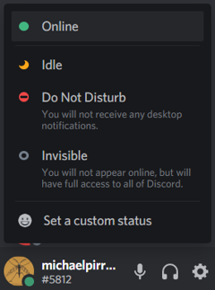

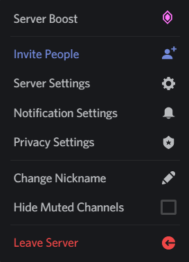
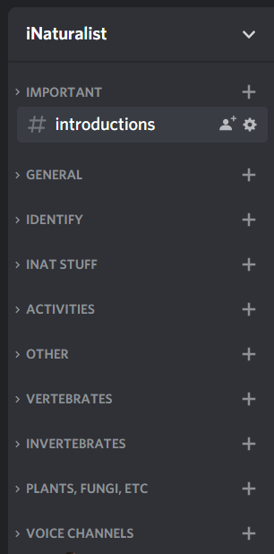

.. |image9| image:: ./Pictures/10000201000002F400000297C8ECDD52253957FB.png
   :width: 3.4638in
   :height: 3.0366in
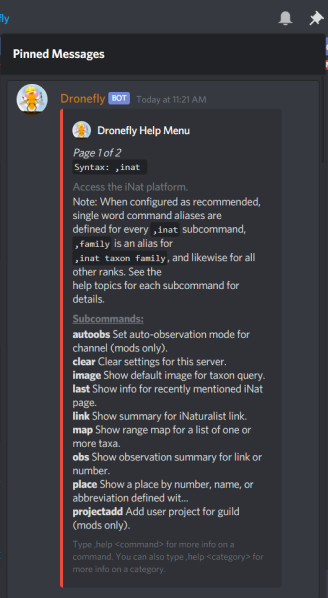
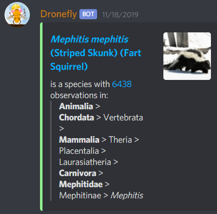

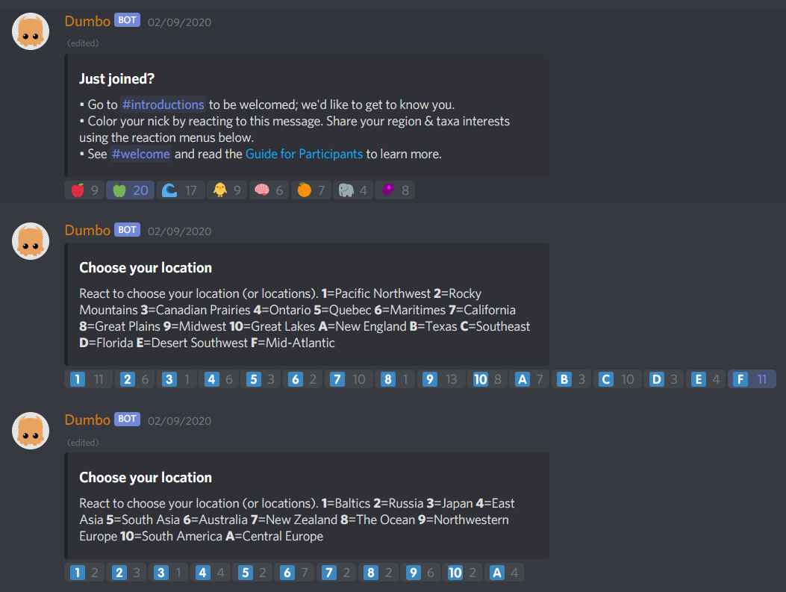
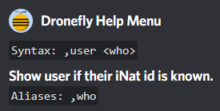
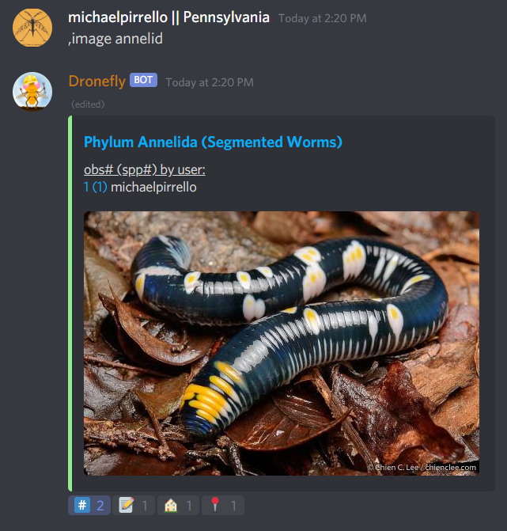
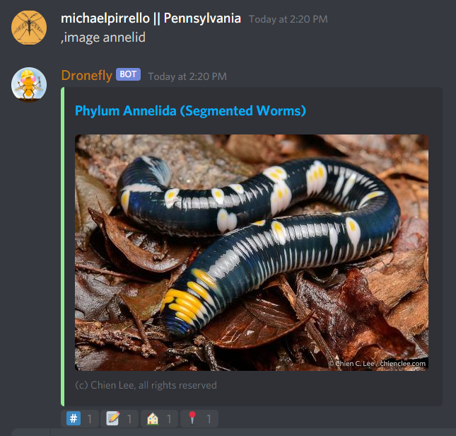

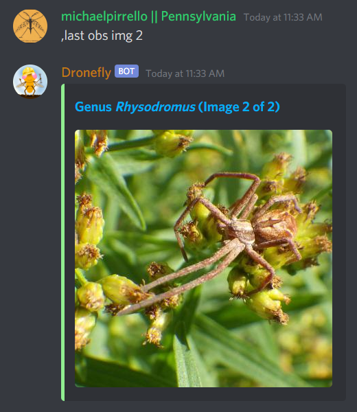
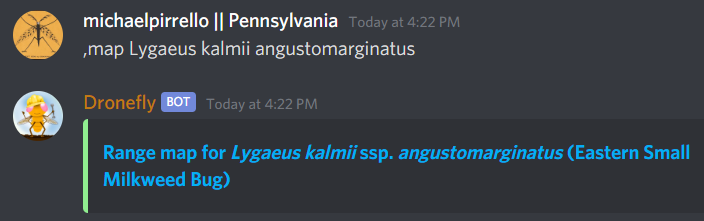
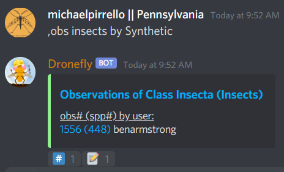
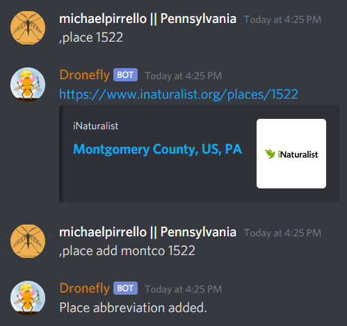
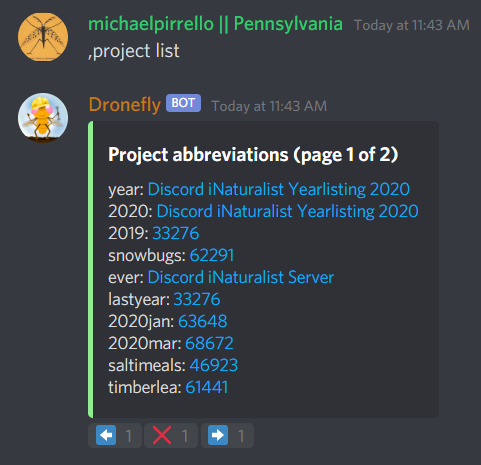
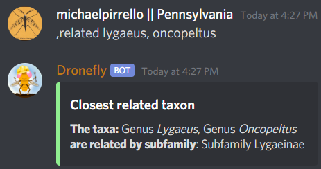
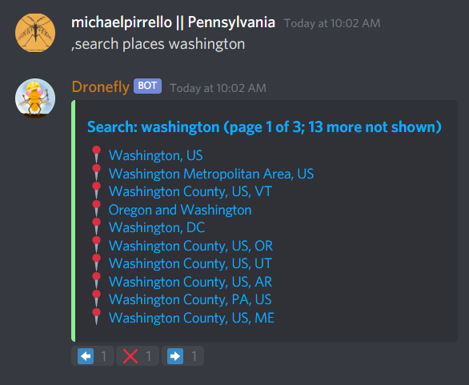
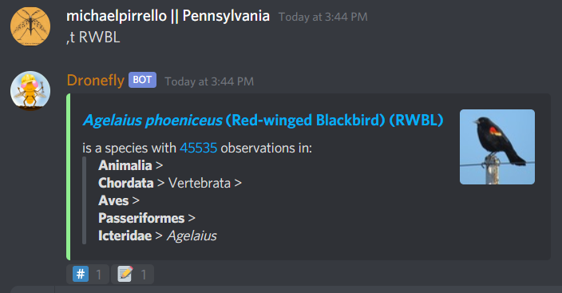

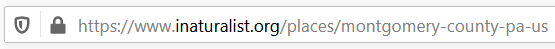

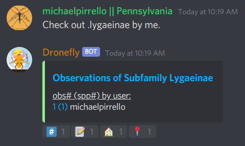
.. |image36| image:: ./Pictures/10000201000002B8000001770AD72CC54041BD01.png
   :width: 3.2673in
   :height: 1.7709in
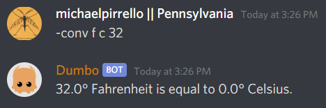
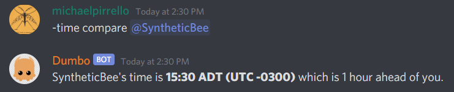

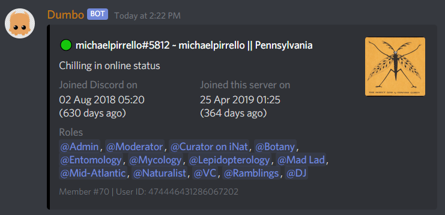
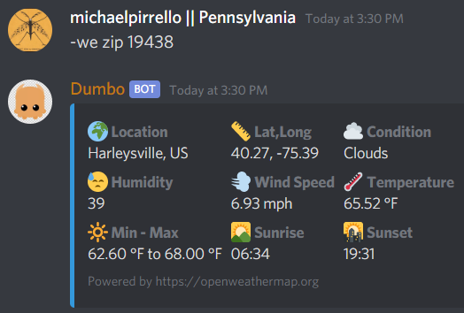
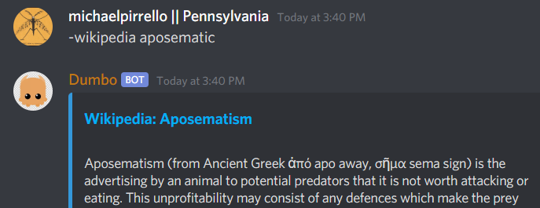

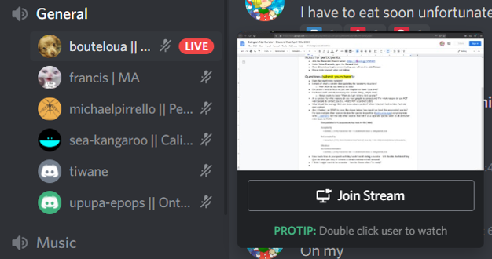

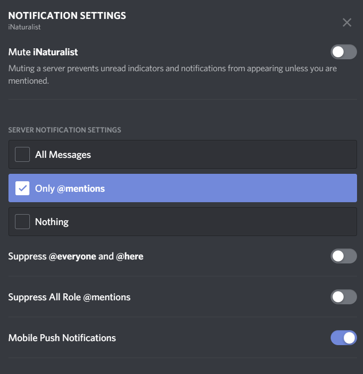
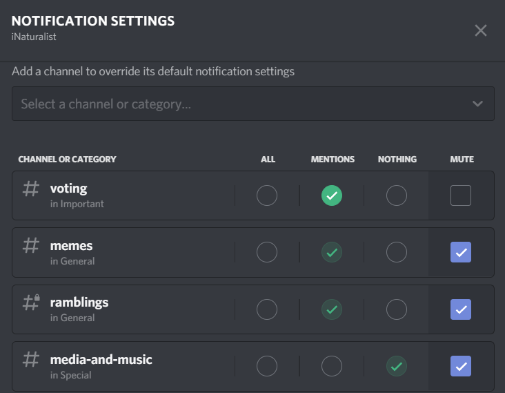
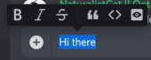
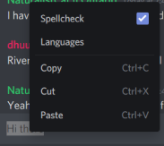

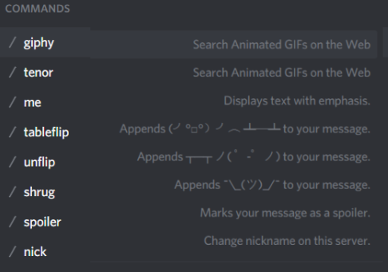

.. |image59| image:: ./Pictures/1000020100000021000000266B1570BDC2C4E14F.png
   :width: 0.2756in
   :height: 0.3181in

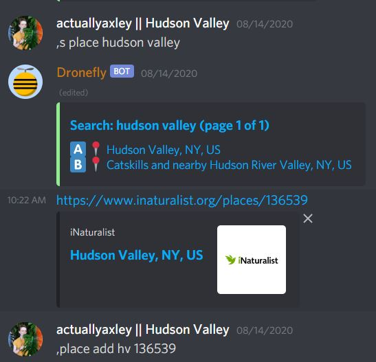

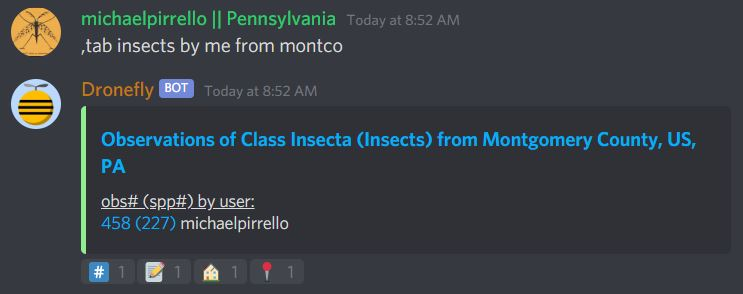
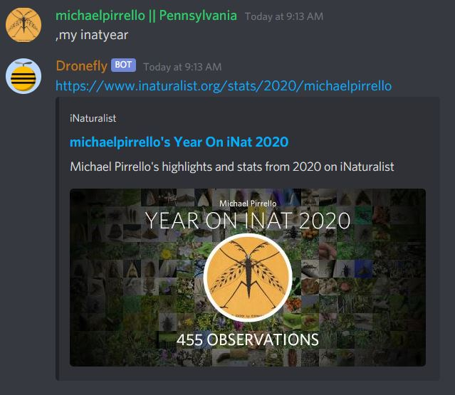
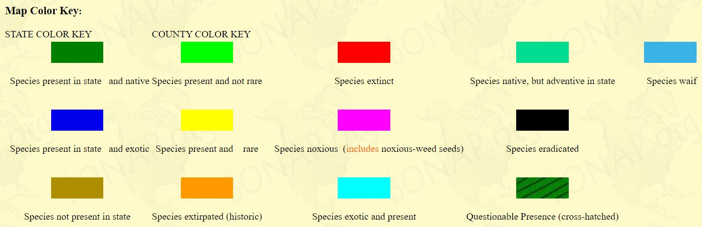
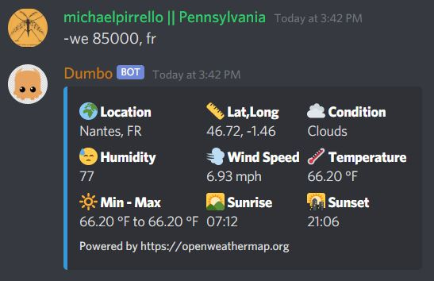
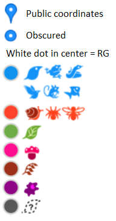
.. |backtick| unicode:: 0x60 .. Workaround vscode syntax highlighting glitch
